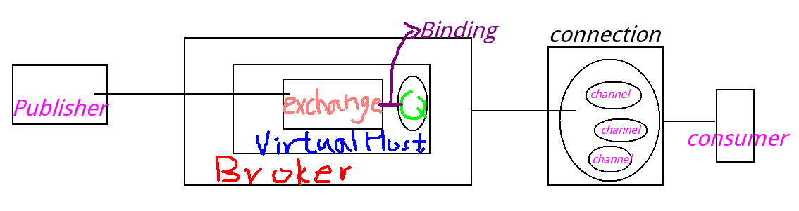
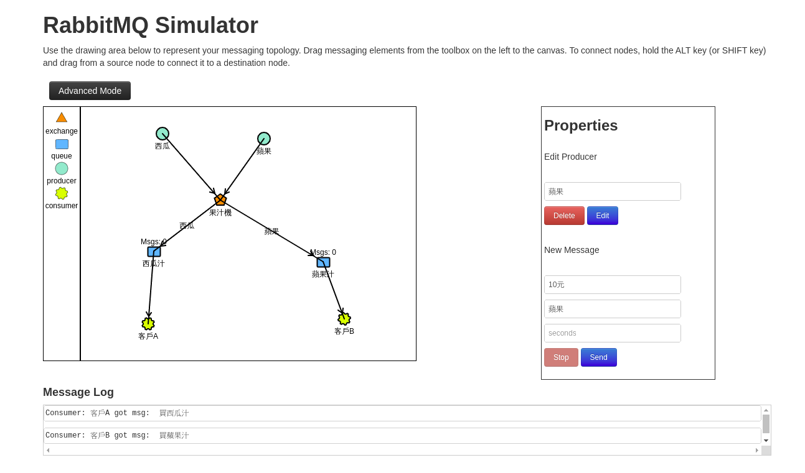

# RabbitMQ 簡介

## AMQP(高級消息隊列協議)理論

- Broker: 收發訊息的應用軟體, RabbitMQ Server就是Message Broker

- Virtual host: 多用戶和安全因素設計的, 把AMQP的基本套件規劃到一個虛擬的地方, 類似於網路的namespace概念 當多個不同的User使用同一個RabbitMQ server,
可以劃分出多個虛擬的Host, 每個User在自己的host建立exchange/queue之類的

- Connection: publisher/consumer和broker之間的TCP連線, 斷開連線的操作只會在client端進行, Broker不會斷開連線, 除非出現網路故障或broker服務有問題

- Channel: 如果每一次訪問RabbitMQ都建立一個Connection, 在訊息量多的时候建立TCP Connection的開銷比較大, 效率也差 Channel是在connection内部建立的邏輯連線, 如果程式支援多執行緒, 通常每個thread建立單獨的channel進行溝通, AMQP method包含了channel id帮助客户端和message broker識別channel, 所以channel之間是完全隔離的Channel當輕量級的Connection也减少操作系统建立TCP connection的開銷

- Exchange: message送到broker的第一站, 根據分送規則, 去查詢表中的routing key, 分送消息到queue中 (常用的類型有：direct (point-to-point/一對一), topic (publish-subscribe/對應關係正則表示法) and fanout (multicast/廣播))

- Queue: 訊息最後被送到這裡等待consumer取走 一個message可以被同时copy到多個queue中

- Binding: exchange和queue之間的虛擬連接, binding中可以包含routing key Binding信息被保存到exchange中的查詢表中, 用來當message的分送依據

## 模擬器

- http://tryrabbitmq.com/

